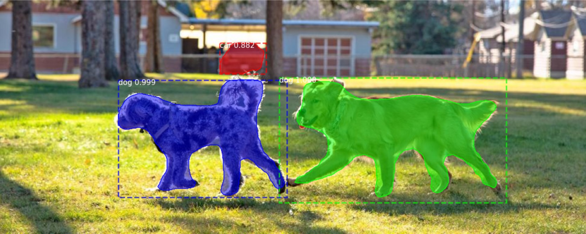

# VisionSegmentation

Image Segmentation Results
<div style="text-align:center;">
  
  
  
  

</div>
<hr>
Video Segmentation Results (person segmentation)
<div style="text-align:center;">
  
  
</div>
<hr>
This repository discusses image and video segmentation. Basically, there are two categories of segmentation namely, instance segmentation and semantic segmentation.

Semantic Segmentation:

In semantic segmentation, the goal is to classify each pixel in an image into predefined classes or categories.
It doesn't distinguish between individual instances of the same object class. Pixels belonging to the same class are grouped together.
While U-Net is a well-known model for semantic segmentation, there are other architectures like Fully Convolutional Networks (FCN), DeepLab, and PSPNet that are commonly used for this task.


Instance Segmentation:

In instance segmentation, the objective is to not only classify pixels into object classes but also to distinguish between different instances of the same object class.
This means that pixels belonging to different objects of the same category are treated as unique instances.
Mask R-CNN is indeed a well-known model for instance segmentation, but there are other approaches like YOLACT, Panoptic FPN, and SOLOv2 that also address this task effectively.

<hr>
NB A: to get the model .h5 file click on the link: [link](https://github.com/ArianFotouhi?tab=repositories)
[link](https://github.com/matterport/Mask_RCNN/releases/download/v2.0/mask_rcnn_coco.h5) .

NB B (Sep 2023): to use Mask RCNN, based on your dependencies version, you may face the error "module 'numpy' has no attribute 'bool'" for line "results = network.detect([image], verbose=0)". To solve it simply uninstall the NumPy and install the older versions like below:

```python
pip uninstall numpy
```

```python
pip install numpy==1.20.0
```
